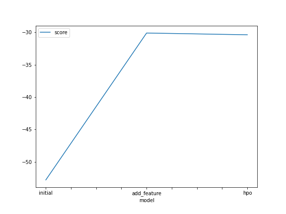
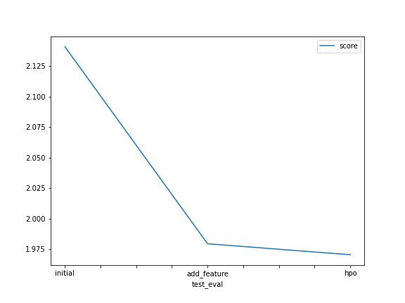

# Report: Predict Bike Sharing Demand with AutoGluon Solution
#### Ahmed Khaled

## Initial Training
### What did you realize when you tried to submit your predictions? What changes were needed to the output of the predictor to submit your results?
Saved in a .csv file

### What was the top ranked model that performed?
The model with hyperparameter optimization.

## Exploratory data analysis and feature creation
### What did the exploratory analysis find and how did you add additional features?
The new features added came fromt he datetime feature. Added two new features "month" and "hour"

### How much better did your model preform after adding additional features and why do you think that is?
The RMSE decreased from: "73.1" to: "17.7". Which is 75% better. If that is saying anything, then it says that the datetime is a very strong dependency.

## Hyper parameter tuning
### How much better did your model preform after trying different hyper parameters?
The default hyperparameters acheive maximum accuracy

### If you were given more time with this dataset, where do you think you would spend more time?
- Try different hyperparameters to see their effect on the RMSE 
- Think of a new feature to add the try default hyperparameters on it

### Create a table with the models you ran, the hyperparameters modified, and the kaggle score.
|model|score|
|--|--|
|initial|52.8|
|add_features|30.1|
|hpo|30.4|

### Create a line plot showing the top model score for the three (or more) training runs during the project.

### Create a line plot showing the top kaggle score for the three (or more) prediction submissions during the project.

